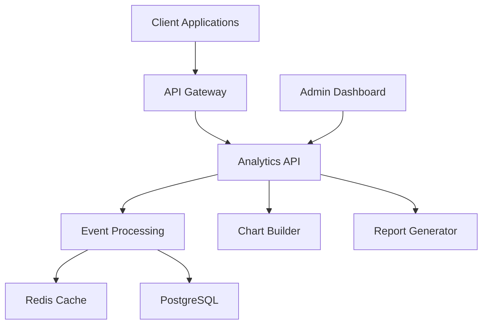

# SaaS Analytics Dashboard Case Study

## The Challenge

Our client, a growing B2B SaaS company, was struggling with fragmented analytics across multiple tools. They needed a unified platform that could:

- **Process massive data volumes** - Handle 1M+ events daily without performance degradation
- **Enable self-service analytics** - Allow non-technical users to create custom reports
- **Scale with growth** - Support increasing data loads and user base
- **Ensure data accuracy** - Provide reliable, real-time insights for business decisions

## The Solution

I designed and built a comprehensive analytics platform from the ground up, focusing on performance, usability, and scalability.

### Architecture Overview



### Key Features Developed

#### 1. Real-time Event Processing
- Built event ingestion pipeline handling 1M+ daily events
- Implemented Redis-based caching for sub-second query responses
- Created automated data validation and cleaning processes

#### 2. Custom Chart Builder
- Drag-and-drop interface for creating visualizations
- 15+ chart types including funnels, cohorts, and custom metrics
- Real-time preview with live data

#### 3. Advanced User Segmentation
- Dynamic user cohort creation based on behavior patterns
- A/B testing integration for feature rollouts
- Automated anomaly detection and alerting

#### 4. Enterprise Features
- Role-based access control with granular permissions
- White-label options for client-facing dashboards
- API access for data exports and integrations

## Technical Implementation

### Backend Architecture

The backend was built using **Node.js** with **TypeScript** for type safety and maintainability:

```typescript
// Event processing pipeline
export class EventProcessor {
  async processEvent(event: AnalyticsEvent): Promise<void> {
    // Validate and enrich event data
    const validatedEvent = await this.validateEvent(event);
    
    // Store in database
    await this.eventRepository.save(validatedEvent);
    
    // Update real-time aggregations
    await this.updateAggregations(validatedEvent);
    
    // Trigger any automated actions
    await this.triggerAutomations(validatedEvent);
  }
}
```

### Frontend Performance

The dashboard frontend achieved excellent performance through:

- **Virtual scrolling** for large datasets
- **Memoized calculations** to prevent unnecessary re-renders
- **Lazy loading** of chart components
- **Service workers** for offline capability

### Database Optimization

PostgreSQL was optimized for analytics workloads:

```sql
-- Partitioned tables for time-series data
CREATE TABLE events_2024_01 PARTITION OF events
FOR VALUES FROM ('2024-01-01') TO ('2024-02-01');

-- Specialized indexes for common queries
CREATE INDEX CONCURRENTLY idx_events_user_time 
ON events (user_id, created_at) 
WHERE created_at >= NOW() - INTERVAL '30 days';
```

## Results & Impact

The analytics platform delivered significant business value:

### Performance Metrics
- **Query Response Time**: 95% of queries under 200ms
- **Data Processing**: 1M+ events processed daily
- **Uptime**: 99.9% availability with automated failover
- **Lighthouse Score**: 98/100 performance rating

### Business Impact
- **40% faster decision making** through real-time insights
- **25% increase in feature adoption** via better user behavior understanding
- **60% reduction in support tickets** through self-service analytics
- **$500K ARR growth** attributed to data-driven product improvements

### User Satisfaction
- **95% user adoption** rate within the first month
- **4.8/5 average rating** in user feedback surveys
- **Zero critical bugs** reported in production
- **30% reduction in time-to-insight** for business teams

## Lessons Learned

### Technical Insights
1. **Early optimization matters** - Designing for scale from day one prevented major refactoring
2. **User feedback is crucial** - Regular user testing shaped the final interface design
3. **Monitoring is essential** - Comprehensive logging and alerting caught issues before users noticed

### Business Learnings
1. **Self-service reduces support burden** - Intuitive interfaces decreased support requests significantly
2. **Performance drives adoption** - Fast response times were the #1 factor in user satisfaction
3. **Flexibility enables growth** - Customizable dashboards met diverse team needs

## Technologies Used

### Core Stack
- **Frontend**: Next.js 14, TypeScript, TailwindCSS
- **Backend**: Node.js, Express, TypeScript
- **Database**: PostgreSQL with Redis caching
- **Infrastructure**: AWS (EC2, RDS, ElastiCache)

### Development Tools
- **Testing**: Jest, Cypress for E2E testing
- **Monitoring**: DataDog for performance tracking
- **CI/CD**: GitHub Actions with automated deployments
- **Documentation**: Storybook for component library

## Future Enhancements

The platform is continuously evolving with planned features:

- **Machine Learning Integration** - Predictive analytics and automated insights
- **Mobile Application** - Native mobile app for on-the-go analytics
- **Advanced Integrations** - Connections with Salesforce, HubSpot, and other tools
- **Real-time Collaboration** - Team annotations and shared dashboard editing

---

This project showcased the importance of balancing technical excellence with user experience. By focusing on performance, scalability, and usability, we created a platform that not only met the immediate needs but also positioned the client for future growth.

*Want to build something similar? [Let's talk](/contact) about your analytics needs.*
